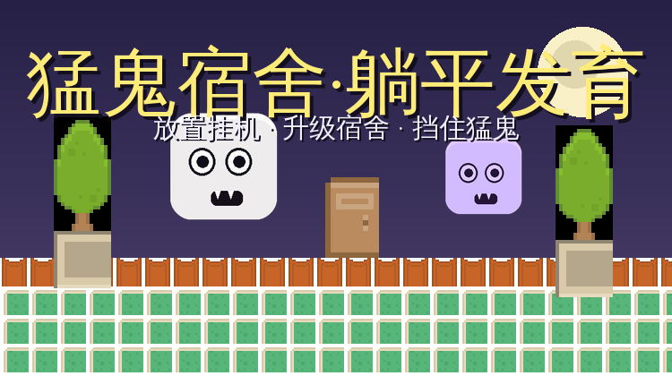

# 猛鬼宿舍·躺平发育

> 微信小程序放置游戏。参考《猛鬼宿舍》玩法的放置化改编：
> 躺平睡觉赚金币，升级床位、大门、炮塔和灵魂祭坛，招募英雄，自动抵御一波又一波的猛鬼。
> 离线也有收益，关键资源看广告获取。



## 玩法

- **6 张床位**：每张床是一个躺平者，自动产金币+经验。按顺序解锁，各自升级。
- **大门**：抵挡猛鬼攻击，等级越高血越厚、反击越强（3 种门外观随等级变化）。
- **炮塔**：自动攻击来袭猛鬼，主要输出。
- **灵魂祭坛**：献祭灵魂，全局产量 +25%/级。
- **英雄（v0.2）**：用灵魂招募 4 位英雄，各有所长：
  - 圣骑士：+防御 DPS
  - 暗影猎手：降低猛鬼伤害（上限 50%）
  - 战斗法师：大幅提升防御 DPS
  - 治愈祭司：大门持续回血
- **猛鬼波次**：每波鬼更多更硬；**每 10 波出现 Boss**（血量×10、伤害×2.5，奖励×5）。
  门被打空会弹出「看广告复活 / 接受失败」抉择。
- **每日任务 + 成就（v0.2）**：每天 3 个任务（看广告领奖）+ 10 个成就，灵魂奖励。
- **离线收益**：最多累积 8 小时（50% 效率），看广告可翻倍。

## 广告变现点

| 广告位 | 奖励 | 冷却/限制 |
|---|---|---|
| coin_bonus | 金币红包（cps×5分钟） | 30 分钟 |
| income_boost | 全局产量 ×2 | 2 小时 |
| wave_delay | 猛鬼延后 10 分钟 | 10 分钟 |
| door_fix | 大门回满血 | 残血<40%可用 |
| offline_double | 离线收益 ×2 | 每次离线 |
| revive | 门破复活（回50%血） | 每局1次+60s |
| daily_bonus (v0.2) | 金币(cps×10min)+100灵魂 | 每天 1 次 |
| hero_deal (v0.2) | 英雄招募/升级 7 折券 | 10 分钟 |
| task_reward (v0.2) | 每日任务完成领奖 | 每个任务 1 次 |
| banner | 底部 banner | 常驻 |

开发阶段 `config.js` 的 `AD_DEBUG: true` 会模拟广告直接通过，方便开发者工具调试。
上线前改为 `false` 并填入真实 `adUnitId`。

## 目录结构

```
pages/        小程序页面（index 主游戏 + settings 设置）
js/core/      纯 JS 核心逻辑（Node 可测，不依赖 wx）
js/wx/        wx 封装层（存档、1s tick 循环、广告）
js/battle/    2D 战场渲染层 v0.3（环境无关，Web/小程序共用）
web/          Web 试玩版（复用同一份核心，canvas 战场）
images/       CC0 游戏素材
tests/        核心逻辑测试 + 3 天数值模拟 + 战场渲染层无头测试
docs/         开发日志 + AI 断点交接文档
config.js     广告位配置（★ 上线前修改）
```

## Web 试玩版

浏览器直接玩：`web/index.html`（部署在 [GitHub Pages](https://xycjscs.github.io/menggui-tangping/)）。
与小程序共用同一份 `js/core/gameCore.js` 数值逻辑与 `js/battle/battleView.js` 战场渲染层，零分叉。
广告为 3 秒倒计时模拟（Web 无真实广告位）。

## 本地测试

```bash
node tests/simulate.js   # 146 断言 + 3 天 AI 挂机模拟（含 Boss/英雄/战场渲染层）
node tests/tune.js       # 数值曲线调参对比
```

在 [微信开发者工具](https://developers.weixin.qq.com/miniprogram/dev/devtools/download.html) 中导入本目录即可预览（需替换 `project.config.json` 的 appid）。

## 素材授权

全部素材来自 [Kenney](https://kenney.nl)，**CC0 公共领域**，可商用无需署名（已尽量署名）：
- [Roguelike RPG Pack](https://kenney.nl/assets/roguelike-rpg-pack)（tile/门/床/图标）
- [Game Icons](https://kenney.nl/assets/game-icons)（UI 图标）
- [Monster Builder Pack](https://kenney.nl/assets/monster-builder-pack)（幽灵怪物部件）

## 开发文档

- [docs/DEV_LOG.md](docs/DEV_LOG.md) — 开发日志（人类向）
- [docs/AI_HANDOFF.md](docs/AI_HANDOFF.md) — AI 断点交接文档（架构决策/踩坑/待办）

## 版本

- v0.1.0 — 基础放置循环（床/门/炮塔/祭坛 + 波次 + 7 广告位）
- v0.2.0 — 英雄系统 / Boss 波 / 每日任务 / 成就 / 每日福利 / 英雄7折 / 任务领奖（+3 广告位，共 10 个）
- v0.3.0 — **2D 可视化战场**（俯视战棋）：canvas 实时渲染，猛鬼从走廊阴影走出并推进列阵、突刺攻击大门；炮塔旋转追踪 + 曳光弹道；Boss 1.7 倍体型 + 红圈光环；门受击震屏闪红；死亡爆裂 + 灵魂/金币掉落飘字。Web 试玩版与小程序共用同一份 `js/battle/battleView.js` 渲染层，核心数值零改动。
- v0.4.0 — **三屏游戏流程 + 点触菜单 + 关卡制**（响应"别做成文字游戏，游戏画面才是主展示"）：
  - **首页**：关卡选择（8 关、通关解锁、星级评价）/ 长效钱包（跨关卡累计金币·灵魂）/ 每日福利 / 广告福利
  - **进入页**：关卡详情 + 初始配置 + 入场支援三选一（免费）+ 精锐支援（钱包付费）
  - **游戏屏**：战场 canvas 为主角，**点床/门/炮塔/祭坛/英雄 → 元素旁弹出上下文菜单**（升级/解锁/招募），点空白收起；顶部只留退出/关卡进度/资源
  - 关卡 = 一局自包含波次挑战：清除 N 波通关 → 结算进钱包 + 星级（未复活 3 星 / 1 次复活 2 星 / 多次 1 星），门破看广告复活或认输
  - 新增 `js/levels.js`（关卡数据，UMD，Node 可测）；battleView 加 `hitTest` 命中检测；核心 `gameCore.js` 数值仍零改动
- v0.5.0 — **可放置道具系统 + 界面减文字**（响应"缺少放置各类道具的功能、视觉上文字太多"）：
  - **战场 4 个道具插槽**（宿舍区 2 + 门前走廊 2）：点空槽弹"放置"菜单（2×2 选项），点已占槽弹"拆除"
  - 4 类道具（效果全部进核心结算，可测）：🚧 路障（独立 150 屏障 HP 替门挨打）/ 🔱 尖刺（防御 +6 DPS）/ 🏮 招财灯（+2.5 金币/s）/ 💊 急救包（灵魂换门 35% 血，消耗型）
  - 道具成本随该类已放置数量递增（防无脑堆叠）；拆除不返还
  - **减文字**：战场 HUD 图标化（W1/⚔3/⏳1:04/🚪，删掉"炮塔 Lv"行），提示语压缩；菜单全部点触弹出，无底部堆叠
  - 核心 `gameCore.js` 新增 `placeItem/removeItem/itemSlotInfo` + 屏障吸伤结算；老存档自动迁移 `itemSlots`
- v0.6.0 — **微信小程序手机端适配**（响应"优先适配微信小程序的手机应用场景"）：
  - **触控热区放大 1.85×**（battleView `touch:true`）：设计空间 750 宽缩到手机屏小元素只有 ~5px 半径，手指点不准；触控模式放大炮塔/祭坛/英雄/床/插槽命中区，Web 鼠标保持精确
  - **自定义导航栏 + 安全区**：`navigationStyle:custom` + 状态栏占位（刘海屏不挡内容）+ 底部 `env(safe-area-inset-bottom)`（Home Indicator 不挡状态坞）
  - **canvas 保比例**：JS 按 `windowWidth×430/750` 注入画布高度，任何屏都不变形；dpr 封顶 2（3x 屏不爆帧）
  - **底部图标状态坞**：纯图标+数字（📺奖励 / 🛏产量 / ⚔DPS / 🚪门耐久%），单手拇指可触；门低时点它直接弹门升级菜单（快捷路径）；📺=看广告本局金币+50%（每局 1 次，新广告位 `game_bonus`）
  - **性能**：`lazyCodeLoading` 按需注入；切后台停逻辑循环+rAF（省电），回来自动恢复
  - **手感**：`wx.vibrateShort` 轻震动（开局/波次/Boss/门破/通关）；微信好友 + 朋友圈分享（`onShareAppMessage`/`onShareTimeline`）
  - 测试 200/200 全绿（+4 条触控热区断言）；Web 端零影响（touch 默认 false）
